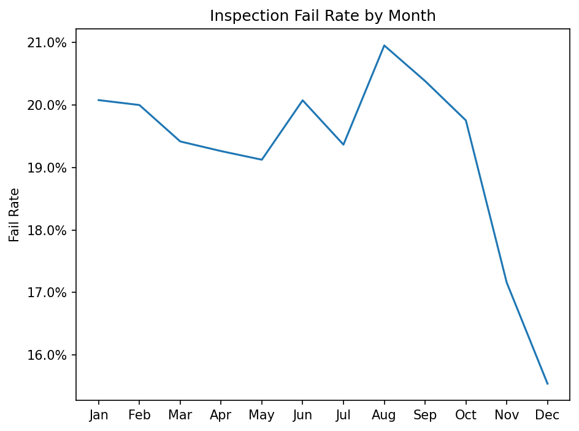
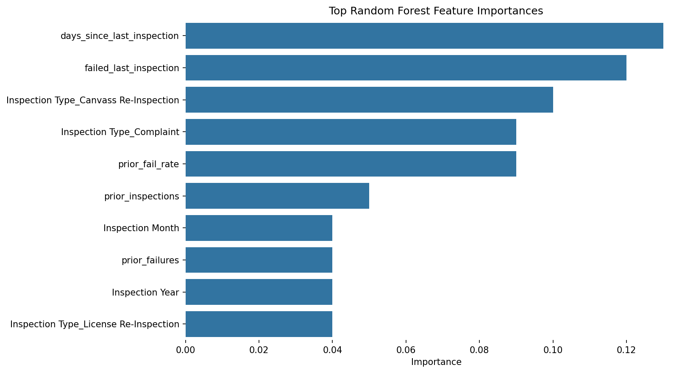

# Chicago Food Inspections - Analysis & Predictive Modeling

**Author:** Henry Lapchick  
**Dataset:** City of Chicago Food Inspections — July 2018 to March 2026  
**Tools:** Python, Pandas, NumPy, Scikit-learn, Matplotlib, Seaborn  

---

## Table of Contents

- [Project Overview](#project-overview)
- [Executive Summary](#executive-summary)
- [Dataset](#dataset)
- [Exploratory Analysis](#exploratory-analysis)
- [Modeling](#modeling)
- [Interactive Dashboard](#interactive-dashboard)
- [Limitations & Next Steps](#limitations--next-steps)

---

## Project Overview

| | |
|---|---|
| **Dataset** | City of Chicago Food Inspections — July 2018 to March 2026 (~134,000 records) |
| **Notebooks** | `chicago_food_eda.ipynb` · `chicago_food_modeling.ipynb` |
| **Goal** | Predict inspection failure before it occurs to help prioritize city inspection resources |
| **Best Model** | Random Forest — 75% recall on fail class (~3x improvement over random baseline) |
| **GitHub** | https://github.com/henrylap/chicago-food-inspections |

---

## Executive Summary

The analysis of Chicago Food Inspections from July 2018 to March 2026 showed a citywide average inspection failure rate of 22.8% (25,662 records), indicating a notable class imbalance. Restaurants constitute the majority of inspections, with an average failure rate of 18.6%. Long-term care facilities had the highest overall failure rate at 25.1%, meaningfully above the citywide average. Seasonal patterns suggest higher failure rates in the summer months (around 20% from July–August) and lower failure rates towards the fall/winter (around 15% from September–December).

Analysis of first-time vs. repeat inspection failure rates (26.4% and 21.8%, respectively) indicates that newer facilities or those early in their inspection history carry a higher risk of failure. Risk category (Low / Medium / High) appears to determine inspection frequency rather than failure likelihood and thus carries little predictive value. ZIP codes 60625 and 60639 warrant further investigation due to their high inspection demand and elevated failure rates.

---

## Dataset

### Source

City of Chicago Data Portal — Food Inspections dataset  
https://data.cityofchicago.org/Health-Human-Services/Food-Inspections/4ijn-s7e5/about_data

### Scope

This dataset consists of approximately 134,000 inspection records spanning July 2018 to March 2026. It covers 106 unique ZIP codes across the Chicago area, 18 different inspection types, and a wide selection of facility types.

### Key Fields

| Field | Description |
|---|---|
| Results | Inspection outcome: Pass, Pass w/ Conditions, Fail, Out of Business, etc. |
| Facility Type | Type of establishment (grouped into 5 categories for modeling) |
| Inspection Type | Reason for inspection: Canvass, Complaint, License, etc. |
| Risk | City-assigned risk tier: Risk 1 (High), Risk 2 (Medium), Risk 3 (Low) |
| ZIP Code | Geographic identifier used for spatial analysis |
| License # | Unique facility identifier used to build inspection history features |
| Inspection Date | Used for temporal features and chronological sorting |
| Violations | Free-text violations field — excluded due to sparsity and unstructured format |

### Exclusions & Filtering

- Records with outcomes of `Out of Business`, `No Entry`, `Not Ready`, and `Business Not Located` were excluded from modeling as they do not reflect actual inspection results
- `Pass w/ Conditions` was retained and treated as a non-failure, consistent with the city's own pass/fail designation
- ZIP codes with fewer than 250 inspections were excluded from geographic analysis to avoid small-sample noise
- License numbers of 0 or null were dropped before engineering historical features

---

## Exploratory Analysis

> Full analysis: `chicago_food_eda.ipynb`

### Class Imbalance

Due to the ~22.8% fail rate, a model predicting the majority class would be 77.2% accurate while catching zero failures. To correct for this, `class_weight='balanced'` was used as a hyperparameter during model setup.

### Facility Type

Among the most common facility types, Long-Term Care had the highest failure rate at 25.1%, sitting meaningfully above the citywide average of 22.8%. Restaurants, which constitute the vast majority of inspections, had a failure rate of only 18.6%.

### Inspection Type

Complaint-driven inspections show materially worse outcome distributions compared to routine canvass inspections. This makes sense as complaints are formed from real-world, observable problems.

### Seasonal Patterns

Fail rates show a seasonal decline from ~20% in summer months (July–August) to ~15% in fall/winter (September–December). This indicates that `Inspection Month` carries predictive signal and was included as a modeling feature.

### First-Time vs. Repeat Inspections

Repeat inspections have a fail rate of ~21.8%, around 4.6 percentage points lower than first-time inspection fail rates (26.4%). This suggests that newer facilities or those earlier in their inspection history carry higher risk of failure, possibly due to less established food safety practices. This finding directly motivated the engineering of historical license-level features in the modeling notebook.

### Risk Category

Fail rates are essentially flat across the city's three risk tiers (High / Medium / Low). The city's risk classification appears to determine inspection frequency rather than failure likelihood. Risk was therefore excluded from the modeling feature set.

### Geographic Variation

The highest-volume ZIPs (60647, 60614) show fail rates close to the citywide average of ~22.8%. The highest fail-rate ZIPs (60620 at 28.0%, 60617 at 27.9%) are geographically distinct, concentrated on the South and West sides of Chicago — not simply artifacts of high inspection volume. 60625 and 60639 appear in both the high-volume and high-fail-rate lists, making them the most operationally concerning ZIPs. ZIP code is included as a modeling feature given its apparent predictive signal.

---

## Modeling

> Full analysis: `chicago_food_modeling.ipynb`

### Feature Engineering

In addition to raw dataset fields, the following historical features were engineered at the license level:

| Feature | Description |
|---|---|
| `prior_inspections` | Total number of prior inspections for this facility |
| `prior_failures` | Cumulative failures across all prior inspections |
| `prior_fail_rate` | Failure rate across all prior inspections |
| `days_since_last_inspection` | Days elapsed since the previous inspection |
| `failed_last_inspection` | Binary flag: did the previous inspection result in failure? |

All historical features are computed using only information available **before** the current inspection to prevent data leakage. Records are sorted chronologically by license number and outcomes are shifted forward by one row before any cumulative calculations.

### Models Tested

Three baseline classifiers were evaluated, all using `class_weight='balanced'`:

| Model | Notes |
|---|---|
| Logistic Regression | Interpretable baseline — balanced recall and precision tradeoff |
| Decision Tree (max_depth=4) | Most aggressive — high recall but excessive false positives |
| Random Forest (n=100, max_depth=10) | Best overall tradeoff — selected as strongest baseline |

### Results

| Model | Fail Recall | Fail Precision | Fail F1 | Accuracy |
|---|---|---|---|---|
| Logistic Regression | 68% | 32% | 0.43 | 59% |
| Decision Tree | 90% | 27% | 0.41 | 40% |
| **Random Forest** | **75%** | **31%** | **0.44** | **56%** |

The Random Forest achieves **75% recall on the fail class** — roughly a **3x improvement over random baseline** (~23% base rate). Precision sits at ~31%, so the model is best used as a prioritization tool rather than a definitive predictor.

### Top Features by Importance

The most important features were the historical license-level features — `prior_fail_rate`, `days_since_last_inspection`, and `failed_last_inspection` ranked highest. This confirms that a facility's inspection history is the strongest signal for predicting future outcomes. Temporal (`Inspection Month`, `Inspection Year`) and geographic (`Zip`) features also contributed meaningfully.

---

## Limitations & Next Steps

- The `Violations` column was excluded — it's free-text and has ~39k nulls, so it wasn't worth including in the analysis for this version. NLP on it would probably add real signal though.
- No hyperparameter tuning was done — these are all baseline models with manually set parameters
- Used `pd.get_dummies` instead of a proper sklearn Pipeline — works fine but would be the first thing to clean up
- Everything is trained on historical data where the outcome is already known — making this a real-time tool would need more work
- Next step would probably be trying XGBoost and actually tuning the Random Forest

